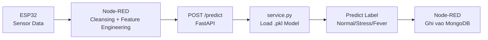

# Huong Dan Su Dung He Thong Machine Learning

## Kiến Trúc Dữ Liệu

Xem chi tiết đầy đủ tại: [DATA_ARCHITECTURE.md](./DATA_ARCHITECTURE.md)

Bao gồm:
- **Tầng 1 — MQTT**: Payload ESP32 gửi lên broker
- **Tầng 2 — Data Lake** (`raw_sensor`): Backup thô, TTL 30 ngày
- **Tầng 3 — Data Warehouse** (`realtime_health_data`): Dữ liệu real-time đã clean + engineered
- **Tầng 4 — Training Data** (`training_health_data`): Dữ liệu huấn luyện ML (15,002 docs)

---

## Muc Luc

- [Cau truc he thong](#cau-truc-he-thong)
- [Cai dat moi truong](#cai-dat-moi-truong)
- [Huong dan su dung](#huong-dan-su-dung)
  - [Huong dan su dung](#huong-dan-su-dung-1)
  - [Chay FastAPI server](#chay-fastapi-server)
  - [Su dung RealtimePredictor](#su-dung-realtimepredictor)
- [Cac endpoint API](#cac-endpoint-api)
- [Dinh nghia cac nhan](#dinh-nghia-cac-nhan)
- [Dac ta 12 features](#dac-ta-12-features)
- [Ket qua dau ra](#ket-qua-dau-ra)
- [Thu muc scripts](#thu-muc-scripts)
- [Cau hinh (.env)](#cau-hinh-env)

---

## Cau truc he thong

```
backend/iot-ingestion/
├── main.py                      # FastAPI server (POST /predict, GET /health)
├── service.py                   # Logic inference - load model va du doan
├── config.py                    # Cau hinh tu .env (MongoDB, paths,...)
├── database.py                  # Ket noi MongoDB singleton
├── schemas.py                   # Pydantic request/response schemas
├── models.py                    # Dataclass document schemas
├── train_enhanced.py           # Script huan luyen mo hinh (chinh)
├── ml_model/
│   ├── predictor.py             # RealtimePredictor class (cho MQTT stream)
│   └── random_forest.pkl       # Mo hinh da huan luyen
├── result/                      # Ket qua training (bieu do, so lieu)
│   ├── training_summary.txt
│   ├── model_comparison.csv
│   └── *.png
└── scripts/                     # Cac script phu
    ├── generate_synthetic.py
    ├── clear_labels.py
    ├── analyze_realtime.py
    └── ...
```

### Luong du lieu



---

## Cai dat moi truong

### 1. Tao virtual environment

```
cd backend\iot-ingestion
python -m venv venv
venv\Scripts\activate.bat
```

### 2. Cai dat dependencies

```
pip install -r requirements.txt
```

Hoac su dung script cau san:

```
setup_packages.bat
```

### 3. Cau hinh .env

Tao/chinh sua file `.env` trong `backend/iot-ingestion/`:

```env
# MongoDB
MONGO_URI=mongodb://localhost:27017
MONGO_DB_NAME=iomt_health_monitor

# MongoDB Collections
TRAINING_COLLECTION=training_health_data
REALTIME_COLLECTION=realtime_health_data
RAW_SENSOR_COLLECTION=raw_sensor

# MQTT
MQTT_BROKER_HOST=localhost
MQTT_BROKER_PORT=1883
MQTT_TOPIC=esp32/health/data

# HTTP Server
HTTP_HOST=0.0.0.0
HTTP_PORT=8000

# ML
ML_MODEL_PATH=ml_model/random_forest.pkl
CSV_DATA_PATH=../../Data/health_data_all.csv
```

### 4. Kiem tra MongoDB

```
mongosh
```

Hoac kiem tra bang script:

```
python scripts\_check_col.py
```

---

## Huong dan su dung

### Huong dan su dung

#### Buoc 1: Chuan bi du lieu

Du lieu huan luyen nam o `Data/health_data_all.csv` (9914 mau ban dau, 9428 sau khi loc Error).

Phan bo nhan:

| Nhan | So luong | Mo ta |
|------|----------|-------|
| Normal | 6111 | Trang thai binh thuong |
| Stress | 2388 | Ap luc, lo lang |
| Fever  | 929  | Sot, nhiet do cao |

#### Buoc 2: Huan luyen mo hinh

```
cd backend\iot-ingestion
venv\Scripts\activate.bat
python train_enhanced.py
```

**Quy trinh training (7 giai doan):**

```
[STEP 1] Doc du lieu tu CSV
  → 9428 mau (loc 486 mau Error)

[STEP 2] Feature Engineering
  → Tao 8 derived features tu 4 sensor goc

[STEP 3] Tao visualizations
  → Phan bo sinh ly, ma tran tuong quan

STAGE A: Baseline GridSearchCV
  → RandomForest (162 combos, 3-fold CV)
  → XGBoost (256 combos, 3-fold CV)

STAGE B: Optuna Bayesian Optimization
  → RandomForest (25 trials)
  → XGBoost (25 trials)

STAGE C: Feature Selection
  → SelectKBest + Optuna (tim features toi uu)

STAGE D: SMOTE Experiment
  → Thu voi/khong SMOTE, so sanh F1

STAGE E: Ensemble Stacking
  → RF + XGBoost + ExtraTrees + LogisticRegression

STAGE F: Test Set Evaluation
  → So sanh tat ca mo hinh tren tap test (20%)

STAGE G: Retrain + Save
  → Retrain mo hinh tot nhat tren 100% data
  → Luu vao ml_model/random_forest.pkl
```

**Ket qua training:**

Sau khi hoan tat, xem tom tat tai:

```
backend/iot-ingestion/result/training_summary.txt
backend/iot-ingestion/result/model_comparison.csv
backend/iot-ingestion/result/*.png
```

#### Buoc 3: Kiem tra model

```
pytest scripts\test_feature_parity.py
```

---

### Chay FastAPI server

#### Cach 1: Uvicorn (khuyen nghi)

```
cd backend\iot-ingestion
uvicorn main:app --host 0.0.0.0 --port 8000 --reload
```

#### Cach 2: Python direct

```
cd backend\iot-ingestion
python main.py
```

Server se bat dau tai `http://localhost:8000`.

#### Kiem tra

```
curl http://localhost:8000/health
```

Swagger UI: `http://localhost:8000/docs`

---

### Su dung RealtimePredictor

Dung `RealtimePredictor` class trong `ml_model/predictor.py` cho du doan truc tiep (khong can HTTP):

```python
from ml_model.predictor import RealtimePredictor

# Khoi tao (tu dong load model)
predictor = RealtimePredictor()

# Du lieu cam bien tu ESP32
sensor_data = {
    "bpm": 85.0,
    "spo2": 97.0,
    "body_temp": 37.2,
    "gsr_adc": 3500.0,
}

# Du doan
label = predictor.predict(sensor_data)
print(label)  # "Stress"
```

RealtimePredictor se tu dong:
- Tao 8 engineered features tu 4 sensor goc
- Load model tu `ml_model/random_forest.pkl`
- Tra ve nhan: `Normal`, `Stress`, `Fever`

---

## Cac endpoint API

### POST /predict

Du doan nhan suc khoe tu du lieu da duoc feature-engineered.

**Request:**

```json
{
  "bpm": 85.0,
  "spo2": 97.0,
  "body_temp": 37.2,
  "gsr_adc": 3500.0,
  "bpm_spo2_ratio": 0.8763,
  "temp_gsr_interaction": 130.2,
  "bpm_temp_product": 3145.0,
  "spo2_gsr_ratio": 0.0277,
  "bpm_deviation": 10.0,
  "temp_deviation": 0.4,
  "gsr_deviation": 1300.0,
  "physiological_stress_index": 0.4909,
  "device_id": "esp32_001",
  "timestamp": 1711612800000
}
```

**Response:**

```json
{
  "predicted_label": "Stress",
  "confidence": 0.8732
}
```

**curl:**

```
curl -X POST http://localhost:8000/predict -H "Content-Type: application/json" -d "{\"bpm\": 85.0, \"spo2\": 97.0, \"body_temp\": 37.2, \"gsr_adc\": 3500.0, \"bpm_spo2_ratio\": 0.8763, \"temp_gsr_interaction\": 130.2, \"bpm_temp_product\": 3145.0, \"spo2_gsr_ratio\": 0.0277, \"bpm_deviation\": 10.0, \"temp_deviation\": 0.4, \"gsr_deviation\": 1300.0, \"physiological_stress_index\": 0.4909, \"device_id\": \"esp32_001\", \"timestamp\": 1711612800000}"
```

### GET /health

Kiem tra trang thai server va model.

```
curl http://localhost:8000/health
```

**Response:**

```json
{
  "status": "ok",
  "model_status": "loaded",
  "mongo_db": "iomt_health_monitor"
}
```

---

## Dinh nghia cac nhan

| Nhan | Mo ta | Dac diem sinh ly |
|------|--------|-----------------|
| **Normal** | Binh thuong | BPM ~60-90, SpO2 ~95-100%, Temp ~36.0-37.0, GSR ~1500-2800 |
| **Stress** | Ap luc, lo lang | BPM cao (>90), GSR tang manh (~>3000), Temp on dinh |
| **Fever** | Sot, nhiet do cao | Temp >37.5, BPM tang nhe, GSR thay doi |

---

## Dac ta 12 features

Mo hinh su dung 12 features (4 sensor goc + 8 engineered).

### 4 Sensor goc

| Feature | Nguon | Mo ta |
|---------|-------|-------|
| `bpm` | MAX30102 | Nhip tim (BPM) |
| `spo2` | MAX30102 | Do bao hoa oxy (%) |
| `body_temp` | MCP9808 | Nhiet do co the (C) |
| `gsr_adc` | ESP32 ADC | Dien tro da GSR (ADC) |

### 8 Engineered features

| Feature | Cong thuc | Y nghia |
|---------|-----------|---------|
| `bpm_spo2_ratio` | `bpm / (spo2 + eps)` | Ty le nhip tim / oxy |
| `temp_gsr_interaction` | `body_temp * gsr_adc / 1000` | Tuong tac nhiet - da |
| `bpm_temp_product` | `bpm * body_temp` | Tich nhip tim - nhiet |
| `spo2_gsr_ratio` | `spo2 / (gsr_adc + eps)` | Ty le oxy / da |
| `bpm_deviation` | `abs(bpm - 75)` | Do lech BPM khoi baseline |
| `temp_deviation` | `abs(body_temp - 36.8)` | Do lech nhiet khoi baseline |
| `gsr_deviation` | `abs(gsr_adc - 2200)` | Do lech GSR khoi baseline |
| `physiological_stress_index` | `(bpm-75)/75 + (gsr-2200)/2200` | Chi so stress tong hop |

> **Quan trong:** 8 engineered features phai duoc tinh toan chinh xac theo cong thuc tren. Node-RED phai tao cac features nay truoc khi goi `/predict`. Neu su dung `RealtimePredictor`, class se tu dong tao 8 features nay.

---

## Ket qua dau ra

Sau khi huan luyen, cac file duoc luu tai:

```
backend/iot-ingestion/result/
├── training_summary.txt          # Tom tat ket qua training
├── model_comparison.csv          # Bang so sanh cac mo hinh
├── 01_physiological_distributions.png  # Phan bo sinh ly
├── 02_correlation_matrix.png     # Ma tran tuong quan
├── 03_confusion_matrix.png       # Ma tran nham lan
├── 04_feature_importance.png     # Do quan trong dac trung
├── 05_cv_comparison.png          # So sanh CV F1-score
└── 06_roc_curves.png             # Duong cong ROC

backend/iot-ingestion/ml_model/
└── random_forest.pkl             # Mo hinh da huan luyen (dung cho inference)
```

---

## Thu muc scripts

Chua cac cong cu phu, chay doc lap:

| Script | Chuc nang |
|--------|-----------|
| `generate_synthetic.py` | Tao 15K mau MongoDB (Normal/Stress/Fever) |
| `clear_labels.py` | Xoa nhan `predicted_label` trong MongoDB |
| `analyze_realtime.py` | Phan tich phan bo du lieu cam bien |
| `query_realtime.py` | Truy van nhanh MongoDB |
| `_check_col.py` | Kiem tra cac collection va document counts |
| `test_feature_parity.py` | Test parity feature engineering Python/Node-RED |

---

## Cau hinh (.env)

| Bien | Mac dinh | Mo ta |
|------|---------|-------|
| `MONGO_URI` | `mongodb://localhost:27017` | URI MongoDB |
| `MONGO_DB_NAME` | `iomt_health_monitor` | Ten database |
| `TRAINING_COLLECTION` | `training_health_data` | Collection du lieu huan luyen |
| `REALTIME_COLLECTION` | `realtime_health_data` | Collection du lieu thoi gian thuc |
| `RAW_SENSOR_COLLECTION` | `raw_sensor` | Collection backup (TTL 30 ngay) |
| `HTTP_HOST` | `0.0.0.0` | Host FastAPI server |
| `HTTP_PORT` | `8000` | Port FastAPI server |
| `ML_MODEL_PATH` | `ml_model/random_forest.pkl` | Duong dan mo hinh |
| `CSV_DATA_PATH` | `../../Data/health_data_all.csv` | Duong dan CSV training |
